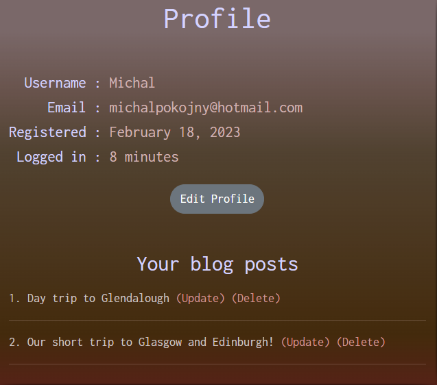
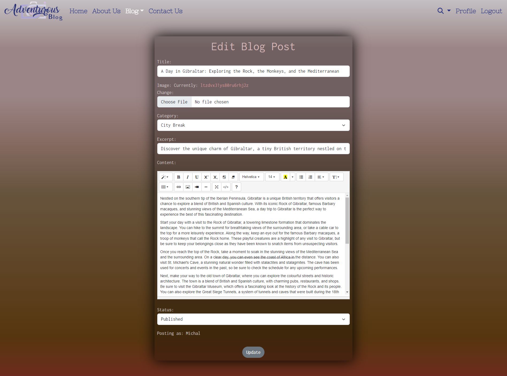

# Features

### Navbar

* Navigation bar with website logo at the top of the website allows users access different pages such as Home, About Us , Blog, Contact, Login/logout, Registration/Profile, search.
* Every page has an active navbar link so users know on what page they are.

* From the navigation bar menu user can also access all categories availible or adding new blog post

* From the navigation bar manu user can also access search bar and look for specific posts or authors

* For smaller devices navbar is collapsible

### Footer 

* Footer section at the bottom of the website include social links with glowing hover effect and contact details

### Home page 

* The Home page design features carousel that welcomes user with 5 images that changes automatically every 5s. The carousel also includes a cover with a short text and an Explore button. Once clicked, the button brings the user to the bottom of the page where they can learn more about the website and its content.

* Carousel

* Bottom of the home page with welcome text

### About Us page

* About us page provides more information about the website and it's background.

### Contact Us page

* This page allows users to send email to the website's administrator with a contact form required fields such as message topic, first name, last name , email address and text message.

* This email form is using EmaiJS API to send messages directly to the website owner.
* Once email has been sent succesfully, user will recieve an email with text thanking for the enquiry and also a notification from the javascript alert box with their first name input. 

### User registration and authentication pages

* This pages allow users to create an account, log in and access additional features of the website such as commenting and liking or profile view.

Sign up page 

Login page

Log out page

### User Profile page

* This page allow users to view their profile with additional details such username, email address, date registered and how long they are logged in.
* Users can also change their username or email adress clicking on the Edit profile, once they update their username or email address, message with text "Profile has been updated" or Error message if profile was no updated is print in the Profile view box.
* If Users created posts they are able to see them in the profile box with their published or draft posts with ability to change them or delete them.

Profile details

Edit profile form

Edit profile success message

User posts list

### Blog page

* On this page users can view all latest blog posts sorted by a date.
* Every post has a featured image or a default image if author won't upload an image.
* Every post has also additional details such as Title of the post, author, date created, category, num. of likes, num. of comments, update or delete post button if user is author of the post or superuser.

* After clicking on one of the post image, title or "Read More link in the excerpt text" user is redirected to a post detail page where he can read more about the post.

* Users can also view latest posts sorted by category.

### Blog post managment

* If user is authenticated and has staff or superuser privilege they can add blog posts.

* If user is author or superuser they can edit their posts.

* If user is author or superuser they can delete their posts.

### Search page

* Search bar in the navbar enables users to find blog posts by title or their author.

* Once searched page will redirect to the search results page and show all the relevant posts.

* If search post is not found, relevant text is displayed.

## Additional features

### Pagination

* All blogs posts page and categories page has pagination feature included displaying 5 posts per page.
* This allows users to  navigate through large dataset by breaking it up into smaller, more manageable pages.
* Pages include buttons to move between pages and also number of the current page displaying.

### Like/Unlike button

* If the user is authenticated they can like or unlike the post.

### Comments

* Every post has a comment section, if post has not been commented yet, "No comments yet." text is displayed.

* If commented 

* Authenticated users can comment posts via comment form.

* Once comment is succesfully sent, users will get a notification with comment awaiting approval.

* Displayed comment once approved.

[Back to README.](./README.md)