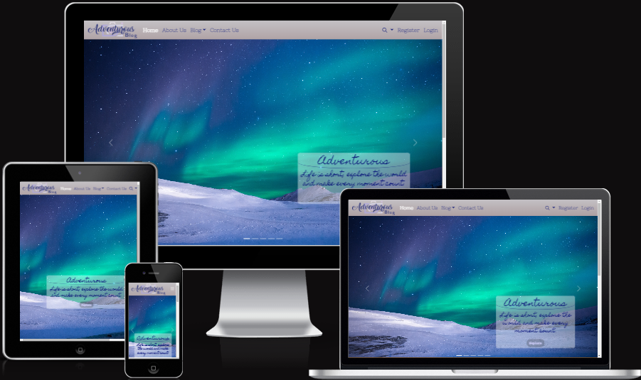

# Travel Blog

## Introduction

This is a Travel Blog Project using Django Framework with Agile methodology approach.
This project is an web application deployed on Heroku that allows users share their travel experiences and adventures with others.
The travel blog is built using Django framework, which is powerful web framework for Python.

The aim of this project is to create community where travelers can document their trips, showcase photos, and connect with like-minded individuals. With a user-friendly design, navigating the website finding relevant information.
Additionally, the project includes an admin interface that allows the administrator to manage content, users, and other aspects of the website.

[Live version of my project](https://adventurous-blog.herokuapp.com/)
  

## Table of Contents

- [Introduction](#travel-blog)
- [User Experience](#user-experience)
    - [User Stories](#user-stories)
    - [Agile Methodology](#agile-methodology)
- [Design](#design)
    - [Wireframes](#wireframes)
    - [Typgraphy and colour scheme](#typography-and-colour-scheme)
- [Database Diagram](#database-diagram)
- [Features](#features)
- [Testing](#testing)
- [Technologies Used](#technologies-used)
- [Deployment](#deployment)
- [Credits](#credits)
- [Acknowledgments](#acknowledgements)        
    
 

## User Experience
 

### Project Goal

* The goal of this project is to provide a platform for users that can discover and share information of their visited travel destinations, activities and tips.
  

### User stories

|  | As a non-logged in user |
| --- | --- |
| 1. | I want to browse the travel blog and view its content without having to create an account. |
| 2. | I want to search for specific blog posts or all author posts. |
| 3. | I want to easily navigate to the different sections of the travel blog. |
| 4. | I want to contact the site owner via email form without registration needed. |
| 5. | I want to register to the website.  |
| 6. | I want to log in to the website once registered.  |

|  | As a logged in user |
| --- | --- |
| 1. | I want to comment on blog posts and interact with other users. |
| 2. | I want to like/unlike the blog posts. |
| 3. | I want to edit my username or email address. |
| 4. | I want to logout from the website. |

|  | As a staff/superuser user |
| --- | --- |
| 1. | I want to create and publish post to the travel blog website. |
| 2. | I want to edit my post to the travel blog website. |
| 3. | I want to delete my post from the blog. |
| 4. | I want to see all my blog posts sorted in my profile page. |
| 5. | I want to create draft posts that can be accessed later. |

|  | As a superuser |
| --- | --- |
| 1. | I want to access all of the website features and settings. |
| 2. | I want to manage all user accounts. |
| 3. | I want to approve/manage all comments on the posts. |
| 4. | I want to add new blog category. |
| 5. | I want to give users authority to staff or superuser. |

 

### Scopes

* Create responsive and user-friendly website allowing users to browse, read blogs, search posts.
* Include user authentication that allows users to register, login to the website for commenting and liking posts.
* Include email API that allows users to send email directly from the website.
* Inluclude summernote text editor for creating new posts.
* Optimize website performance, security, and accessibilty using best practices in web development.

 

### Agile Methodology

My travel blog project was developed using Agile methodology. 
All my user stories, sprint that can be accessed using GitHub Issues, which serverd as a roadmap for my development process can be found [here.](https://github.com/MichalPokojny/CI_project_4_travel_blog/issues?q=is%3Aissue+is%3Aclosed)

 

## Design

### Wireframes

The wireframes for this project can be accessed [here.](./WIREFRAMES.md)

### Typography and colour scheme

## Database diagram

## Features

## Testing

## Technologies Used
- HTML 5
- CSS 3
- Python
- Javascript
- Balsamiq
- LucidChart - Diagram
- Bootstrap
- Jquery
- Django
- GitHub
- GitPod
- LogoAi - create logo

## Deployment

## Credits
- https://www.youtube.com/@AdrianTwarog (Navbar)

## Acknowledgements
