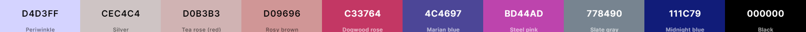

# Adventurous Travel Blog

## Introduction

This is a Travel Blog Project using Django Framework with Agile methodology approach.
This project is an web application deployed on Heroku that allows users share their travel experiences and adventures with others.
The travel blog is built using Django framework, which is powerful web framework for Python.

The aim of this project is to create community where travelers can document their trips, showcase photos, and connect with like-minded individuals. With a user-friendly design, navigating the website finding relevant information.
Additionally, the project includes an admin interface that allows the administrator to manage content, users, and other aspects of the website.

[Live version of my project](https://adventurous-blog.herokuapp.com/)
  

## Table of Contents

- [Introduction](#introduction)
- [User Experience](#user-experience)
    - [Project Goal](#project-goal)
    - [User Stories](#user-stories)
    - [Scopes](#scopes)    
    - [Agile Methodology](#agile-methodology)
- [Design](#design)
    - [Wireframes](#wireframes)
    - [Database Diagram](#database-diagram)
    - [Typography and colour scheme](#typography-and-colour-scheme)
        - [Fonts](#fonts)
        - [Colour](#colour)            
- [Features](#features)
- [Future Features](#future-features)
- [Testing](#testing)
- [Technologies Used](#technologies-used)
- [Python Packages](#python-packages)
- [Deployment](#deployment)
    - [Deploying on heroku](#deploying-on-heroku)
    - [Fork repository](#to-fork-this-repository)
    - [Cloning](#cloning-this-project)    
- [Credits](#credits)
- [Acknowledgments](#acknowledgements)        
    
 

## User Experience
 

### Project Goal

* The goal of this project is to provide a platform for users where they can discover and share information about their travel destinations, activities, and tips.
  

### User stories

|  | As a non-logged in user |
| --- | --- |
| 1. | I want to browse the travel blog and view its content without having to create an account. |
| 2. | I want to search for specific blog posts or all author posts. |
| 3. | I want to easily navigate to the different sections of the travel blog. |
| 4. | I want to contact the site owner via email form without registration needed. |
| 5. | I want to register to the website.  |
| 6. | I want to log in to the website once registered.  |

|  | As a logged in user |
| --- | --- |
| 1. | I want to comment on blog posts and interact with other users. |
| 2. | I want to like/unlike the blog posts. |
| 3. | I want to edit my username or email address. |
| 4. | I want to logout from the website. |

|  | As a staff/superuser user |
| --- | --- |
| 1. | I want to create and publish post to the travel blog website. |
| 2. | I want to edit my post to the travel blog website. |
| 3. | I want to delete my post from the blog. |
| 4. | I want to see all my blog posts sorted in my profile page. |
| 5. | I want to create draft posts that can be accessed later. |

|  | As a superuser |
| --- | --- |
| 1. | I want to access all of the website features and settings. |
| 2. | I want to manage all user accounts. |
| 3. | I want to approve/manage all comments on the posts. |
| 4. | I want to add new blog category. |
| 5. | I want to give users authority to staff or superuser. |

 

### Scopes

* Create responsive and user-friendly website allowing users to browse, read blogs, search posts.
* Include user authentication that allows users to register, login to the website for commenting and liking posts.
* Include email API that allows users to send email directly from the website.
* Inluclude summernote text editor for creating new posts.
* Optimize website performance, security, and accessibilty using best practices in web development.

 

### Agile Methodology

My travel blog project was developed using Agile methodology. 
All my user stories, sprint that can be accessed using GitHub Issues, which serverd as a roadmap for my development process can be found [here.](https://github.com/MichalPokojny/CI_project_4_travel_blog/issues?q=is%3Aissue+is%3Aclosed)

 

## Design

### Wireframes

The wireframes for this project can be accessed [here.](./WIREFRAMES.md)
  

### Database diagram

### Typography and colour scheme

#### Fonts

* For Carousel cover I used font:

* For general body text I used font :

* For navigation bar I used font :

 

#### Colour

Colour pallet used for this website.

## Features

Features of this project can be accessed [here.](./FEATURES.md)
  

## Future features

* Update the website to display messages when the user logs in, registers, or logs out.
* Enhance the blog posts by integrating Google Maps API to show the location of the blog post's place.
* Upgrade to support social authentication in addition to normal login.
* Enable the author to edit or delete post comments.
* Allow registered users to upload profile images.

## Testing

Testing of this project can be accessed [here.](./TESTING.md)
   

## Technologies Used

  -  HTML 5: Provides the main structure of the website.
  -  CSS 3: Used for styling the website.
  -  Bootstrap: Used for general styling and responsiveness of the website.
  -  Python: Used for the website's backend development.
  -  JavaScript: Used for website scripts, including sending emails.
  -  EmailJS: Used for email sending API from the contact form.
  -  Django: Used as the web framework.
  -  Cloudinary: Used for storing the website's static files.
  -  ElephantSQL: Used as the database for this project.
  -  Heroku: Used for hosting the website.
  -  GitHub: Used to store the repository.
  -  GitPod: Used as the workspace for the project.
  -  Balsamiq: Used for wireframe planning.
  -  Font Awesome: Used for icons on the website.
  -  Google Fonts: Used for fonts on the website.
  -  LucidChart: Used for creating the database diagram.
  -  Favicon.ico: Used for generating the website favicon.
  -  Coolors: Used for selecting the color palette of the project.
  -  LogoAi: Used for creating the website logo.
  -  Grammarly: Used for grammar checking all the text on the website and in the readme file.
  -  Google Chrome: Used for main testing of the website on all devices.
  -  Google Chrome Lighthouse: Used for testing the performance of each page.
  -  W3C HTML Validator: Used for validating the HTML code.
  -  Jigsaw CSS Validator: Used for validating the CSS code.
  -  Ci Python Linter: Used for validating the Python code.
  -  JSHint: Used for validating the JavaScript code.
  -  Pxhere: Used for illustrative images on the website.
  -  Microsoft Word: Used for testing documentation.

### Python packages

* asgiref
* cloudinary
* dj-database-url
* dj3-cloudinary-storage
* Django
* django-allauth
* django-crispy-forms
* django-summernote
* gunicorn
* oauthlib
* psycopg2
* PyJWT
* python3-openid
* pytz
* requests-oauthlib
* sqlparse

## Deployment

### Deploying on Heroku

For deployment this project on Heroku, you need to follow these steps:

1. Create Pipfile with all the required dependencies by running the command "pip3 > freeze > requirements.txt" in the terminal.
2. Go to the [Heroku](https://www.heroku.com/) website and create a Heroku account if you haven't already done so.
3. Create a new app by clicking the "New" button and selecting "Create a new app".
4. Choose a name for your app and select your location.
5. Log in to the [ElephantSQL](https://www.ElephantSQL.com.com/) for creating the dabase.
6. In the ElephantSQL click "Create New instance"
7. Set up your plan
8. Select Region
9. Select a data center near you
10. Click review
11. Click "Create instance"
12. Return to ElepantSQL dashboard and click on the "database instance name" for this project.
13. In the URL section, copy the URL
14. Back in the Heroku open settings tab and paste database url from ElephantSQL and Secret key to Config Vars.
15. Go to the "Deploy" tab and click on "Connect to GitHub" to connect your Heroku app to your GitHub Depositary
16. Finally, choose the main branch for deploying. Enable automatic deployment, and then select "manual deploy" to build your app.

### To Fork this repository:

1. Navigate to GitHub project repository [CI_project_4_travel_blog](https://github.com/MichalPokojny/CI_project_4_travel_blog)
2. Click on the "Fork" section in the right-hand corner.
3. Select an owner for the forked repository.
4. Click "Create fork" button.

### Cloning this Project

1. Visit [CI_project_4_travel_blog](https://github.com/MichalPokojny/CI_project_4_travel_blog)
2. Click green button "<> Code", then "Clone or download" button and copy the URL provided.
3. Open a terminal and navigate to the directory whre you want to clone the project.
4. Type following command and paste url "git clone \<url>"
5. Press Enter and the project will be cloned to you local machine.

## Credits
* https://www.youtube.com/@AdrianTwarog (Creating the navbar)
* https://www.youtube.com/@Codemycom (Django walkthrough)
* Inspiration and some of the code of this project were taken from [Code Institute walkthrough project](https://github.com/Code-Institute-Solutions/Django3blog) and fellow students at Code Institue.
* https://www.youtube.com/@KevinPowell Footer social links effect.

## Acknowledgements

* I want to thanks to Code Institute for learning material and support.
* Slack Code Institute community for all issues resolved and support.