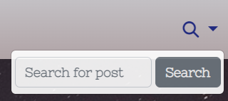
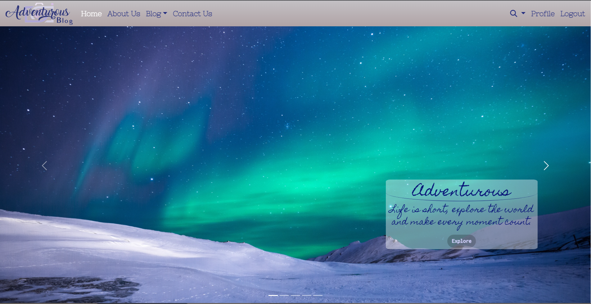
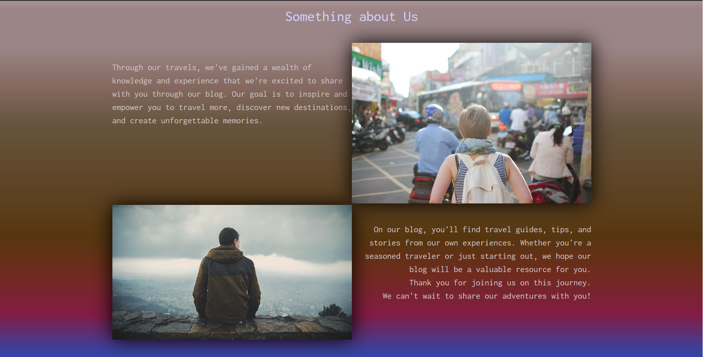
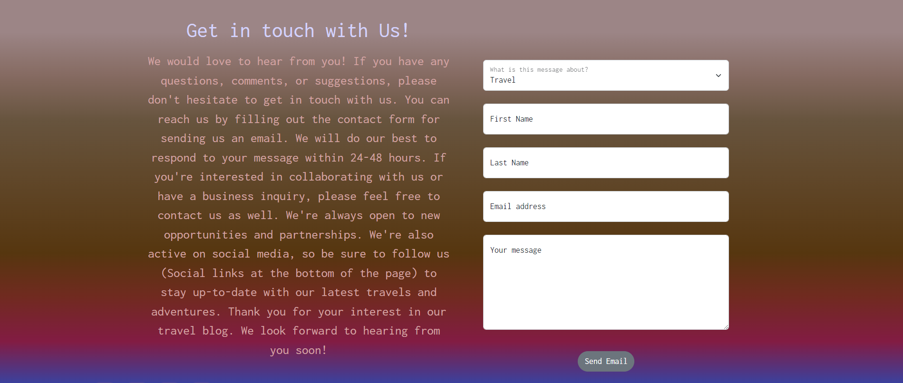
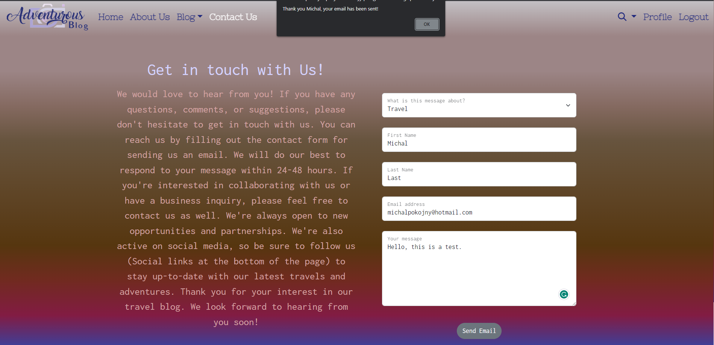
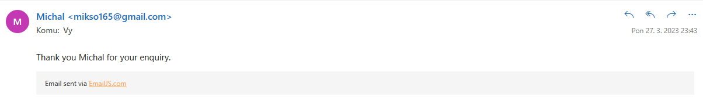
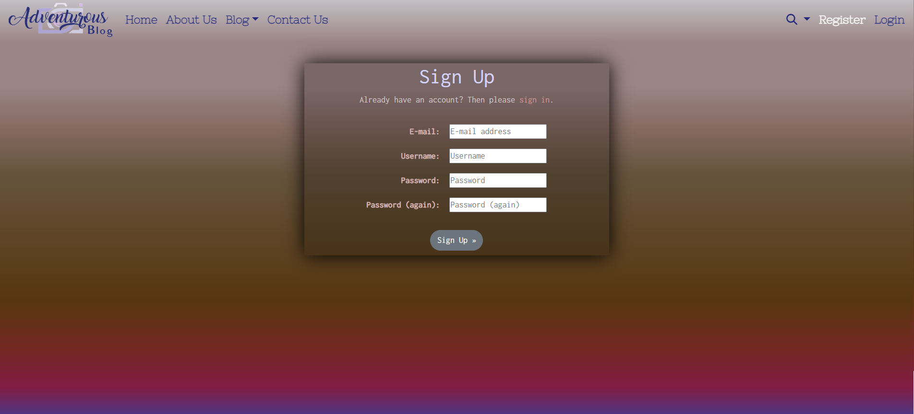
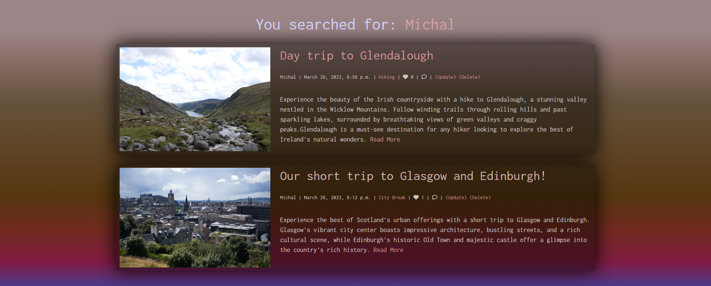
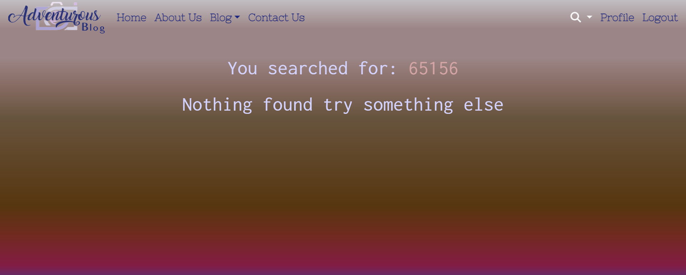

# Adventurous Travel Blog

## Introduction

This is a Travel Blog Project using Django Framework with Agile methodology approach.
This project is an web application deployed on Heroku that allows users share their travel experiences and adventures with others.
The travel blog is built using Django framework, which is powerful web framework for Python.

The aim of this project is to create community where travelers can document their trips, showcase photos, and connect with like-minded individuals. With a user-friendly design, navigating the website finding relevant information.
Additionally, the project includes an admin interface that allows the administrator to manage content, users, and other aspects of the website.

[Live version of my project](https://adventurous-blog.herokuapp.com/)
  

## Table of Contents

- [Introduction](#travel-blog)
- [User Experience](#user-experience)
    - [User Stories](#user-stories)
    - [Agile Methodology](#agile-methodology)
- [Design](#design)
    - [Wireframes](#wireframes)
    - [Typgraphy and colour scheme](#typography-and-colour-scheme)
- [Database Diagram](#database-diagram)
- [Features](#features)
- [Testing](#testing)
- [Technologies Used](#technologies-used)
- [Deployment](#deployment)
- [Credits](#credits)
- [Acknowledgments](#acknowledgements)        
    
 

## User Experience
 

### Project Goal

* The goal of this project is to provide a platform for users that can discover and share information of their visited travel destinations, activities and tips.
  

### User stories

|  | As a non-logged in user |
| --- | --- |
| 1. | I want to browse the travel blog and view its content without having to create an account. |
| 2. | I want to search for specific blog posts or all author posts. |
| 3. | I want to easily navigate to the different sections of the travel blog. |
| 4. | I want to contact the site owner via email form without registration needed. |
| 5. | I want to register to the website.  |
| 6. | I want to log in to the website once registered.  |

|  | As a logged in user |
| --- | --- |
| 1. | I want to comment on blog posts and interact with other users. |
| 2. | I want to like/unlike the blog posts. |
| 3. | I want to edit my username or email address. |
| 4. | I want to logout from the website. |

|  | As a staff/superuser user |
| --- | --- |
| 1. | I want to create and publish post to the travel blog website. |
| 2. | I want to edit my post to the travel blog website. |
| 3. | I want to delete my post from the blog. |
| 4. | I want to see all my blog posts sorted in my profile page. |
| 5. | I want to create draft posts that can be accessed later. |

|  | As a superuser |
| --- | --- |
| 1. | I want to access all of the website features and settings. |
| 2. | I want to manage all user accounts. |
| 3. | I want to approve/manage all comments on the posts. |
| 4. | I want to add new blog category. |
| 5. | I want to give users authority to staff or superuser. |

 

### Scopes

* Create responsive and user-friendly website allowing users to browse, read blogs, search posts.
* Include user authentication that allows users to register, login to the website for commenting and liking posts.
* Include email API that allows users to send email directly from the website.
* Inluclude summernote text editor for creating new posts.
* Optimize website performance, security, and accessibilty using best practices in web development.

 

### Agile Methodology

My travel blog project was developed using Agile methodology. 
All my user stories, sprint that can be accessed using GitHub Issues, which serverd as a roadmap for my development process can be found [here.](https://github.com/MichalPokojny/CI_project_4_travel_blog/issues?q=is%3Aissue+is%3Aclosed)

 

## Design

### Wireframes

The wireframes for this project can be accessed [here.](./WIREFRAMES.md)
  

### Database diagram

### Typography and colour scheme

#### Fonts

* For Carousel cover I used font:

* For general body text I used font :

* For navigation bar I used font :

 

#### Colour

Colour pallet used for this website.

## Features

### Navbar

* Navigation bar with website logo at the top of the website allows users access different pages such as Home, About Us , Blog, Contact, Login/logout, Registration/Profile, search.
* Every page has an active navbar link so users know on what page they are.

* From the navigation bar menu user can also access all categories availible or adding new blog post

* From the navigation bar manu user can also access search bar and look for specific posts or authors

### Footer 

* Footer section at the bottom of the website include social links with glowing hover effect and contact details

### Home page 

* The Home page design features carousel that welcomes user with 5 images that changes automatically every 5s. The carousel also includes a cover with a short text and an Explore button. Once clicked, the button brings the user to the bottom of the page where they can learn more about the website and its content.

* Carousel

* Bottom of the home page with welcome text

### About Us page

* About us page provides more information about the website and it's background.

### Contact Us page

* This page allows users to send email to the website's administrator with a contact form required fields such as message topic, first name, last name , email address and text message.

* This email form is using EmaiJS API to send messages directly to the website owner.
* Once email has been sent succesfully, user will recieve an email with text thanking for the enquiry and also a notification from the javascript alert box with their first name input. 

### User registration and authentication pages

* This pages allow users to create an account, log in and access additional features of the website such as commenting and liking or profile view.

Sign up page 

Login page

Log out page

### User Profile page

* This page allow users to view their profile with additional details such username, email address, date registered and how long they are logged in.
* Users can also change their username or email adress clicking on the Edit profile, once they update their username or email address, message with text "Profile has been updated" or Error message if profile was no updated is print in the Profile view box.
* If Users created posts they are able to see them in the profile box with their published or draft posts with ability to change them or delete them.

Profile details

Edit profile form

Edit profile success message

User posts list

### Search page

* Search bar in the navbar enables users to find blog posts by title or their author.

* Once searched page will redirect to the search results page and show all the relevant posts.

* If search post is not found, relevant text is displayed

## Testing

## Technologies Used
- HTML 5
- CSS 3
- Python
- Javascript
- Balsamiq
- LucidChart - Diagram
- Bootstrap
- Jquery
- Django
- GitHub
- GitPod
- LogoAi - create logo

## Deployment

## Credits
- https://www.youtube.com/@AdrianTwarog (Navbar)

## Acknowledgements
