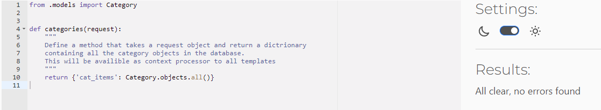
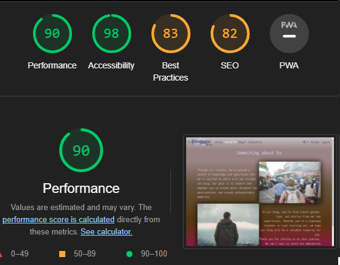
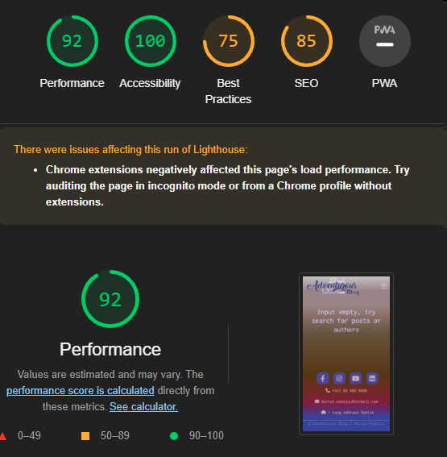

# Testing

## Code Validation

Python

* Python code was tested using PEP8 Code Institute [Python Linter Validator](https://pep8ci.herokuapp.com/)

**Blog app**

views.py

urls.py

models.py

forms.py

context_processors.py

admin.py

**Info app**

views.py

urls.py

HTML

* HTML code was tested using [W3 Validator](https://validator.w3.org/)

Every page has passed the W3 validator

CSS

* CSS code was tested using [Jigsaw W3 Validator](https://jigsaw.w3.org/)

JavaScript

* Javascript code was tested using [JSHint](https://jshint.com/)

## Browser Testing

The website has been tested thoroughly on several different browsers.

* Google Chrome
* Mozilla Firefox
* Microsoft Edge
* Safari
* Opera

### Google Chrome Lighthouse

Lighthouse was used to test performance, Accesibility, Best Practices and SEO of the website.

Desktop

Home page 

About us page 

Blog page 

Contact Us page 

Search page 

Profile page 

Logout page 

Mobile

Home page 

About us page 

Blog page 

Contact Us page 

Search page 

Profile page 

Logout page 

## Black box manual testing

TEST PLAN

TEST DATA

TEST LOG

## Unsolved Bugs

*  Updating post can update all fields except featured image: This means that users can make changes to all parts of a post, including the title, body text, and other fields, but they cannot update the featured image. If they want to change the image, they will need to upload a new one.

* Clicking on page numbers sometimes won't react: This is a user experience issue where users may click on a page number in the pagination, but the page does not load or react. This can be frustrating for users who are trying to navigate the website. This issue needs to be addressed to ensure a smooth user experience.

* In search results comment count is not showing: This means that when users search for posts, the comment count is not displayed in the search results. This information is important for users who want to quickly see how many comments a post has received. The comment count should be added to the search results to improve user experience.

[Back to README.](./README.md)